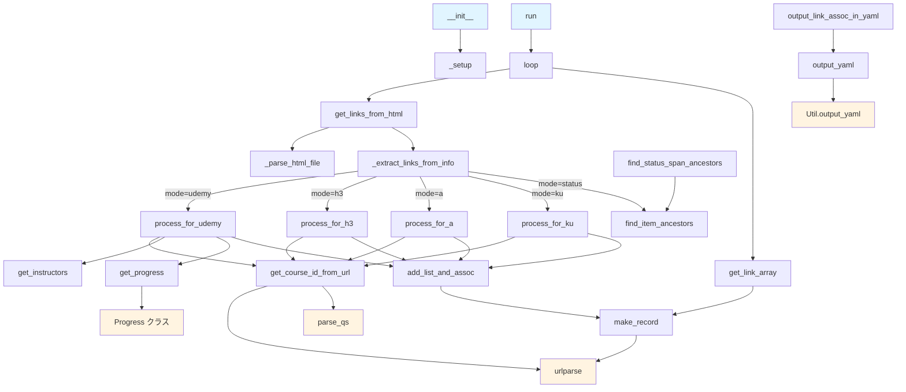
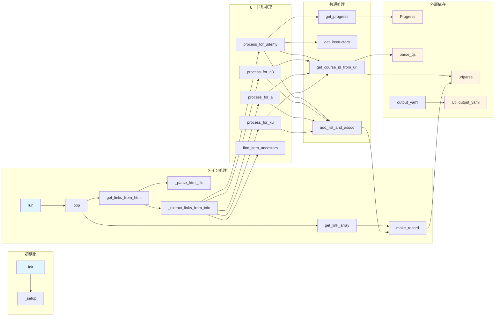

# App クラスのメソッド呼び出し関係図

## 全体フロー図

## 詳細な呼び出し関係図

## メソッド説明

- **初期化系**
  - `__init__`: コンストラクタ
  - `_setup`: インスタンス変数の初期化

- **メイン処理系**
  - `run`: アプリケーションのメイン実行メソッド
  - `loop`: ファイルリストをループ処理
  - `get_links_from_html`: HTMLファイルからリンクを抽出
  - `_parse_html_file`: HTMLファイルをパース
  - `_extract_links_from_info`: モードに応じてリンク抽出処理を分岐

- **モード別処理**
  - `process_for_udemy`: Udemyモードの処理
  - `process_for_h3`: H3モードの処理
  - `process_for_a`: Aモードの処理
  - `process_for_ku`: KUモードの処理

- **ユーティリティ系**
  - `get_course_id_from_url`: URLからコースIDを抽出
  - `get_instructors`: インストラクター情報を取得
  - `get_progress`: 進捗情報を取得
  - `add_list_and_assoc`: リンクをリストと連想配列に追加
  - `make_record`: レコードを作成
  - `get_link_array`: リンクを配列形式に変換

- **出力系**
  - `output_link_assoc_in_yaml`: YAML形式で出力
  - `output_yaml`: YAML出力処理

- **その他**
  - `find_item_ancestors`: アイテムの祖先要素を取得
  - `find_status_span_ancestors`: status spanの祖先要素を取得

